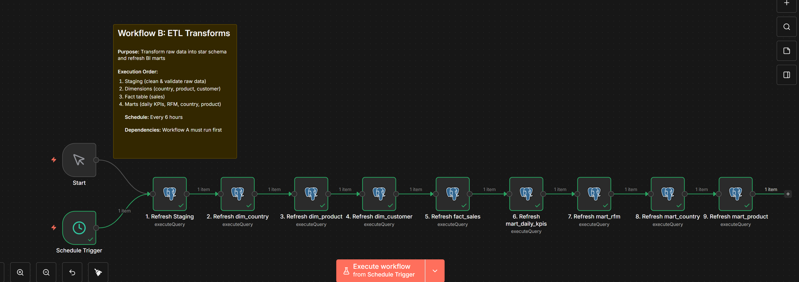

1. Ubacivanje podataka iz data.csv u PostgreSQL bazu preko sql skripte zbog činjenice da n8n zauzaima dosta RAMa pri toj transformaciji iako je taj postupak već rađen ali je samo neoptimizovan
```
PS C:\Users\enit-024\Desktop\Fakultet\Master Studij\7 semestar\Poslovna Inteligencija\99 Projekat> docker exec -it ecommerce_postgres psql -U postgres -d ecommerce_dw -c "TRUNCATE raw_transactions RESTART IDENTITY; COPY raw_transactions(invoice_no,stock_code,description,quantity,invoice_date,unit_price,customer_id,country) FROM '/data/data.csv' WITH (FORMAT csv, HEADER true, ENCODING 'WIN1252');"
TRUNCATE TABLE
COPY 541909

What's next:
    Try Docker Debug for seamless, persistent debugging tools in any container or image → docker debug ecommerce_postgres
    Learn more at https://docs.docker.com/go/debug-cli/
PS C:\Users\enit-024\Desktop\Fakultet\Master Studij\7 semestar\Poslovna Inteligencija\99 Projekat> docker exec -it ecommerce_postgres psql -U postgres -d ecommerce_dw -c "SELECT COUNT(*) FROM raw_transactions;"
 count
--------
 541909
(1 row)


What's next:
    Try Docker Debug for seamless, persistent debugging tools in any container or image → docker debug ecommerce_postgres
    Learn more at https://docs.docker.com/go/debug-cli/
```
2. Pokreni  workflow B za transform ... uzme samo prljavu tabelu iz baze i transformiše je u čistu tabelu u vidu BI warehousea
    * Refresha staging tako sto čisti staging tabelu , briše loše redove i slično
    * Pravi dimenzije tj dimenzije za country, product i customer. Pravi lookup tabele tako da dashboards mogu slice-ati podatke konzistentno tj po proizvodu državi i slično i da se ne ponavlja svugde
    * Pravi fact tabelu koja sadrži sve transakcije i reference ka dimenzijama
    * Pravi Marts tj mart_daily_kpis, mart_rfm, mart_country, mart_product. Pre agregirane ready to chart tabele kao  daily revenue , orders, AOV , RFM tj customer segments, country performance i slično


Na kraju bude
```
PS C:\Users\enit-024\Desktop\Fakultet\Master Studij\7 semestar\Poslovna Inteligencija\99 Projekat> docker exec -it ecommerce_postgres psql -U postgres -d ecommerce_dw -c "
>> SELECT
>>   (SELECT COUNT(*) FROM dim_country) AS dim_country,
>>   (SELECT COUNT(*) FROM dim_product) AS dim_product,
>>   (SELECT COUNT(*) FROM dim_customer) AS dim_customer,
>>   (SELECT COUNT(*) FROM fact_sales) AS fact_sales,
>>   (SELECT COUNT(*) FROM mart_daily_kpis) AS mart_daily_kpis,
>>   (SELECT COUNT(*) FROM mart_rfm) AS mart_rfm;
>> "
 dim_country | dim_product | dim_customer | fact_sales | mart_daily_kpis | mart_rfm
-------------+-------------+--------------+------------+-----------------+----------
          38 |        3937 |         4371 |     539388 |             305 |     4338
(1 row)
```

3. Pokreni workflow C za BI ML Pipeline
    * Provjeri status servisa
    * Treniraj modele radi predikcije na http://ml_service:8000/train
        * ML service pulla historijske daily KPIjeve iz postgresa i pravi predikcije
    * Detekcija Anomalija uz pomoć isolation foresta
    * Sprema rezultate u bazu 
    * Generiše report ako su anomalije detektirane
ML pipeline tj service bi se mogao dnevno pokretati ili sedmično ili slično  , a takođerse može raspravljati o dubini analize i rasponu predikcija

/train trenira modele
/forecast generiše predviđanje
/anomalies detektira anomalije

 Na kraju svega se i kreira report za ovo u MD fajlu ... također se pravi upper i lower bound za forecast i nesigurnost...
 Forecast kaže- šta će se najvjerovatnije desiti
 Anomalije kažu- šta se desilo i zašto se desilo

Za dalje predikcije se koristi:
future = model.make_future_dataframe(periods=request.forecast_days)

7-90 dana je obično za fakat akcije
1 year i dalje je scenario tj STRATEGIJA 