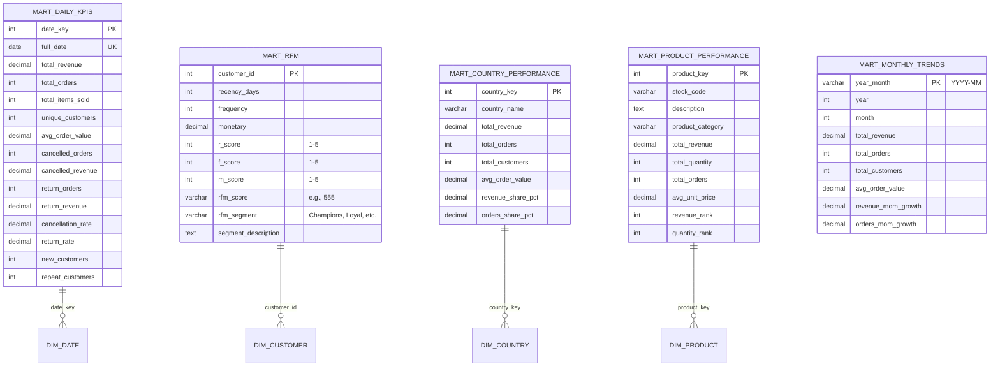
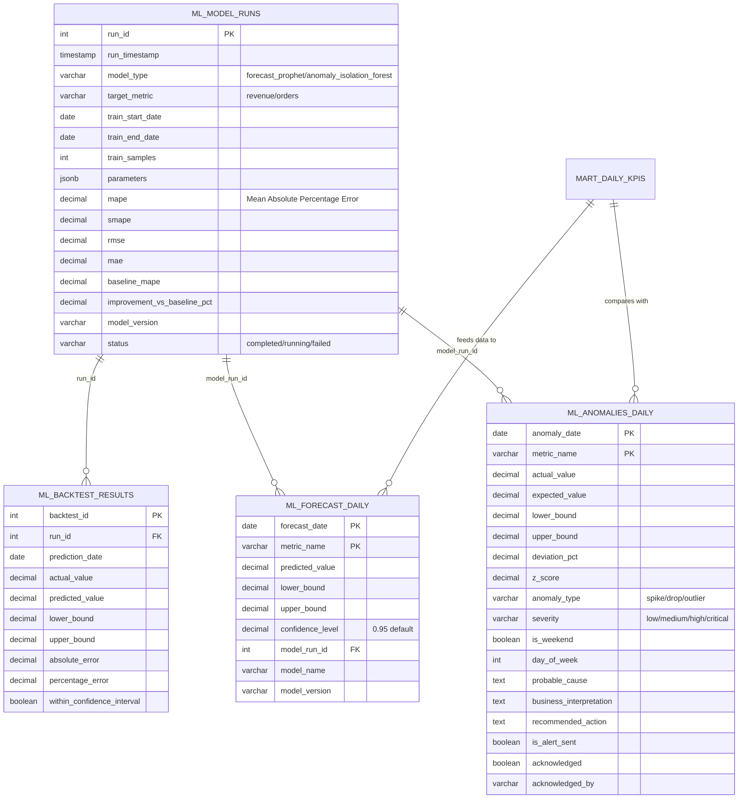
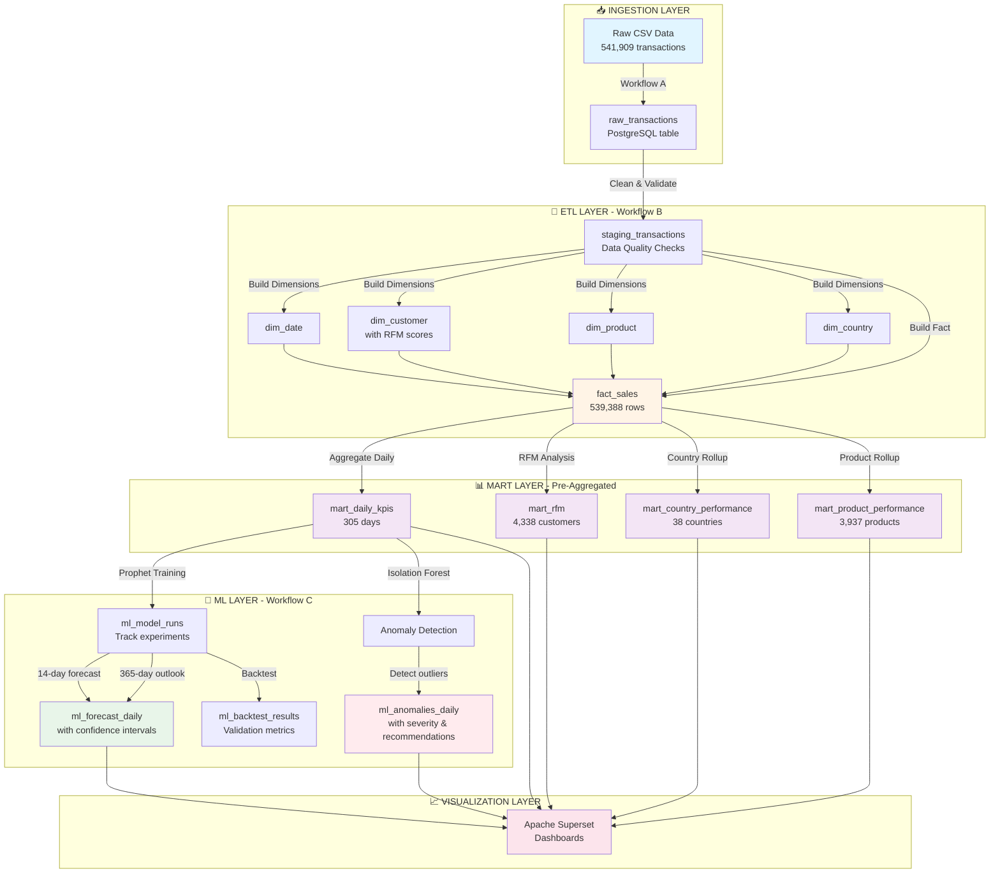
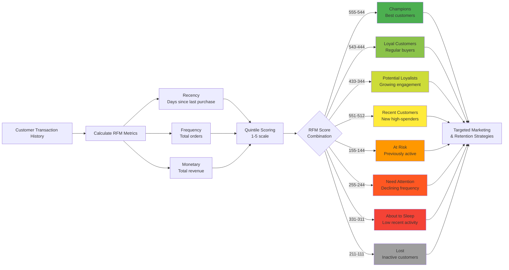

# E-Commerce BI Data Model Diagrams

## 🎯 Key Contributions & Story

This BI project transforms raw transactional data into **actionable business intelligence** through a modern data architecture:

### **Key Contributions:**

1. **Star Schema Design** - Optimized for analytical queries with fact/dimension separation
2. **RFM Customer Segmentation** - Advanced customer intelligence with 11 behavioral segments
3. **ML-Powered Forecasting** - Prophet-based predictions with confidence intervals
4. **Anomaly Detection** - Isolation Forest for automatic issue detection
5. **Multi-Layer Marts** - Pre-aggregated tables for sub-second dashboard performance
6. **Full Lineage Tracking** - Model versioning, backtest results, and data quality monitoring

---

## 📊 Star Schema - Core Data Model

```mermaid
erDiagram
    FACT_SALES ||--o{ DIM_DATE : "date_key"
    FACT_SALES ||--o{ DIM_CUSTOMER : "customer_key"
    FACT_SALES ||--o{ DIM_PRODUCT : "product_key"
    FACT_SALES ||--o{ DIM_COUNTRY : "country_key"

    FACT_SALES {
        int sales_key PK
        int date_key FK
        int customer_key FK
        int product_key FK
        int country_key FK
        varchar invoice_no
        int quantity
        decimal unit_price
        decimal line_total
        boolean is_cancelled
        boolean is_return
    }

    DIM_DATE {
        int date_key PK
        date full_date UK
        int year
        int quarter
        int month
        varchar month_name
        int week_of_year
        int day_of_month
        int day_of_week
        varchar day_name
        boolean is_weekend
        int fiscal_year
        int fiscal_quarter
    }

    DIM_CUSTOMER {
        int customer_key PK
        int customer_id UK
        date first_purchase_date
        date last_purchase_date
        int total_orders
        decimal total_revenue
        decimal avg_order_value
        varchar customer_segment
        int rfm_recency_score
        int rfm_frequency_score
        int rfm_monetary_score
        varchar rfm_segment
    }

    DIM_PRODUCT {
        int product_key PK
        varchar stock_code UK
        text description
        varchar product_category
        decimal avg_unit_price
        int total_quantity_sold
        decimal total_revenue
        date first_sold_date
        date last_sold_date
    }

    DIM_COUNTRY {
        int country_key PK
        varchar country_name UK
        varchar region
        int total_customers
        int total_orders
        decimal total_revenue
    }
```



---

## 🎯 BI Marts Layer - Analytics-Ready Tables



---

## 🤖 ML Pipeline - Forecasting & Anomaly Detection



---

## 🔄 Complete Data Flow Architecture



---

## 🎨 RFM Segmentation Logic



---

## 📊 Business Questions This Model Answers

| **Question** | **Data Source** | **Technique** |
|-------------|-----------------|---------------|
| **Are we growing?** | `mart_daily_kpis`, `mart_monthly_trends` | Time series analysis |
| **Where do we make money?** | `mart_country_performance`, `mart_product_performance` | Geographic & product segmentation |
| **Who are our best customers?** | `mart_rfm`, `dim_customer` | RFM behavioral segmentation |
| **What happens next week?** | `ml_forecast_daily` (14-day) | Prophet forecasting |
| **What about next year?** | `ml_forecast_daily` (365-day) | Long-term strategic outlook |
| **Did something break?** | `ml_anomalies_daily` | Isolation Forest detection |
| **Can we trust predictions?** | `ml_model_runs`, `ml_backtest_results` | MAPE vs baseline, backtesting |
| **Which customers are leaving?** | `mart_rfm` (At Risk, Lost segments) | RFM thresholds |
| **What drives cancellations?** | `mart_daily_kpis.cancellation_rate` | Trend analysis |

---

## 🏆 Why This Architecture Matters

### **Performance**
- ✅ **Sub-second queries** via pre-aggregated marts
- ✅ **Indexed foreign keys** on fact table (date, customer, product, country)
- ✅ **Composite indexes** for common query patterns

### **Flexibility**
- ✅ **Star schema** allows easy drill-down/roll-up
- ✅ **Modular marts** can be refreshed independently
- ✅ **JSONB parameters** in ML runs for schema evolution

### **Intelligence**
- ✅ **Automated forecasting** with Prophet (seasonal patterns, holidays)
- ✅ **Context-aware anomalies** (weekend/holiday flags, probable cause)
- ✅ **Model versioning** for reproducibility

### **Actionability**
- ✅ **Business interpretations** in anomaly table
- ✅ **Recommended actions** for each alert
- ✅ **Severity classification** for prioritization
- ✅ **RFM segment descriptions** for marketing campaigns

---

## 📏 Data Volumes (Current State)

```
Raw Data:          541,909 transactions
Fact Sales:        539,388 rows (after quality filters)
Dimensions:
  ├─ Countries:    38
  ├─ Products:     3,937
  ├─ Customers:    4,371
  └─ Date Range:   Dec 2010 - Dec 2011

Marts:
  ├─ Daily KPIs:   305 days
  ├─ RFM Segments: 4,338 customers
  ├─ Countries:    38 countries
  └─ Products:     3,937 products

ML Outputs:
  ├─ Forecasts:    14-day + 365-day horizons
  └─ Anomalies:    Auto-detected with severity levels
```

---

## 🎓 Educational Value

This project demonstrates:

1. **Dimensional Modeling** - Kimball methodology with slowly changing dimensions
2. **ETL Orchestration** - n8n workflows for reproducible pipelines
3. **Feature Engineering** - RFM scores, growth rates, aggregations
4. **Time Series ML** - Facebook Prophet with seasonality detection
5. **Unsupervised Learning** - Isolation Forest for outlier detection
6. **Model Ops** - Versioning, backtesting, baseline comparisons
7. **Data Quality** - Validation rules, staging layers, audit logs
8. **Visualization** - Apache Superset for self-service BI

---

*Generated from schema files in `/sql/init/`*
